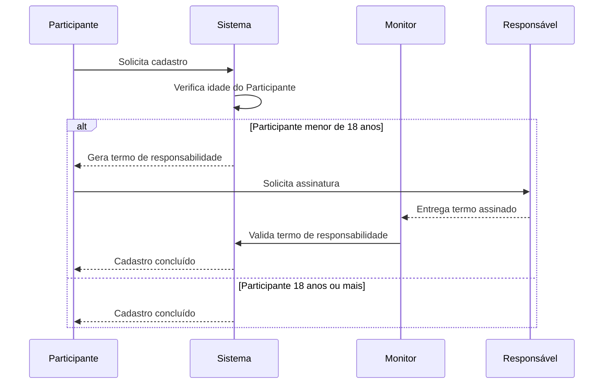
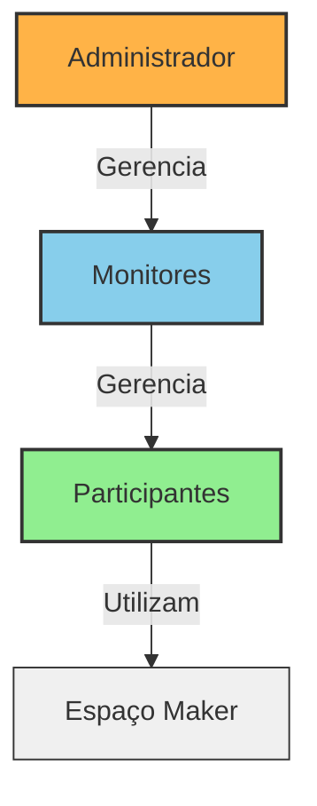

# Usuários do Sistema

O sistema de gestão do Espaço Maker foi projetado para contemplar três perfis principais de usuários: **Administrador**, **Monitor** e **Participante**. Cada um deles possui papéis e permissões distintas, fundamentais para o bom funcionamento do ambiente.

---

## 👨‍💼 Administrador
O **Administrador** é o responsável pela gestão administrativa do sistema.  
Suas principais atribuições são:  
- Gerenciar e manter cadastros de **Monitores** e outros **Administradores**;  
- Acessar todas as funcionalidades administrativas;  
- Garantir a segurança e a integridade dos dados e acessos do sistema.  

👉 Em resumo, o Administrador garante que o sistema esteja **organizado, seguro e atualizado**.

---

## 👩‍🏫 Monitor
O **Monitor** atua diretamente na **operação do Espaço Maker**.  
Suas principais responsabilidades incluem:  
- Cadastrar e gerenciar **usuários do tipo Participante**;  
- Organizar e supervisionar a **Agenda de Atividades**;  
- Controlar **materiais, insumos e Recursos de Trabalho**;  
- Acompanhar o uso do espaço, assegurando o cumprimento das regras.  

👉 O Monitor funciona como um **gestor operacional**, garantindo que as atividades ocorram de forma organizada e segura.

---

## 🧑‍🔧 Participante
O **Participante** é o **usuário final** do espaço. Pode ser:  
- Um **indivíduo** (hobbista, estudante, entusiasta);  
- Ou um **responsável por grupo** (ex.: professor com seus alunos).  

Formas de cadastro:  
- Auto-registro via internet;  
- Cadastro realizado por um Monitor.  

🔒 **Regra especial para menores de idade**  
Durante o processo de cadastro, o sistema deve verificar se o participante possui **menos de 18 anos**.  
- Caso seja **menor de idade**, o sistema deve gerar/imprimir um **termo de responsabilidade** para ser assinado pelo responsável legal.  
- O cadastro somente será concluído após a entrega e validação desse termo.  

Principais ações permitidas:  
- Solicitar participação em **Atividades Programadas**;  
- Reservar o espaço para uso **Livre**;  
- Utilizar recursos do Espaço Maker conforme suas permissões técnicas.  

👉 O Participante é quem efetivamente **vive a experiência do Espaço Maker**, transformando ideias em projetos.

---

## 🔎 Fluxo de Cadastro do Participante (Diagrama de Sequência)

---

## 🔎 Representação Gráfica

