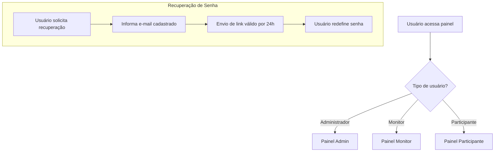

# Login e Recuperação de Senha

O sistema de gestão do Espaço Maker possui mecanismos de **autenticação segura** e **recuperação de senha**, garantindo que cada usuário possa acessar apenas os recursos que lhe competem.

---

## 🔑 Login no Sistema

Cada perfil de usuário possui um **painel de acesso exclusivo**, com funcionalidades específicas:

- **Administrador**  
  [https://endereco_sistema.com.br/PainelAdmin](https://endereco_sistema.com.br/PainelAdmin)  
  Acesso às funções administrativas, como cadastro e gerenciamento de Monitores e Administradores.

- **Monitor**  
  [https://endereco_sistema.com.br/PainelMonitor](https://endereco_sistema.com.br/PainelMonitor)  
  Acesso às funcionalidades de gestão do Espaço Maker, incluindo gerenciamento de Participante, agenda, materiais e atividades.

- **Participante**  
  [https://endereco_sistema.com.br/Painel](https://endereco_sistema.com.br/Painel)  
  Acesso ao painel de usuário, onde pode solicitar participação em atividades, agendar uso do espaço ou consultar informações de seu cadastro.

---

## 🔒 Recuperação de Senha

O sistema conta com um fluxo de recuperação de senha padronizado e seguro:

1. O usuário informa seu **endereço de e-mail cadastrado**.  
2. O sistema envia automaticamente um **link de redefinição de senha** para o e-mail informado.  
3. Esse link terá validade de **24 horas** após a sua criação.  
4. Ao acessar o link, o usuário poderá cadastrar uma **nova senha de acesso**.  

📌 **Observação importante**:  
O campo **e-mail** é **obrigatório** para todos os usuários, justamente para viabilizar o processo de recuperação de senha.

---

## 📊 Fluxo de Autenticação (Representação Gráfica)

