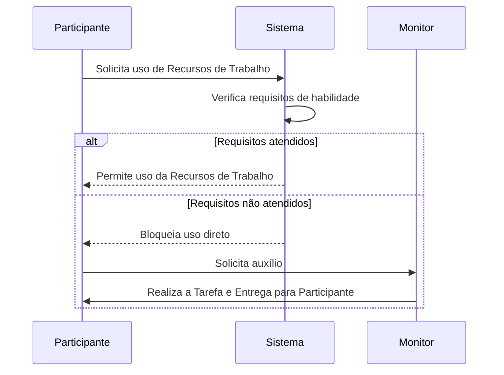
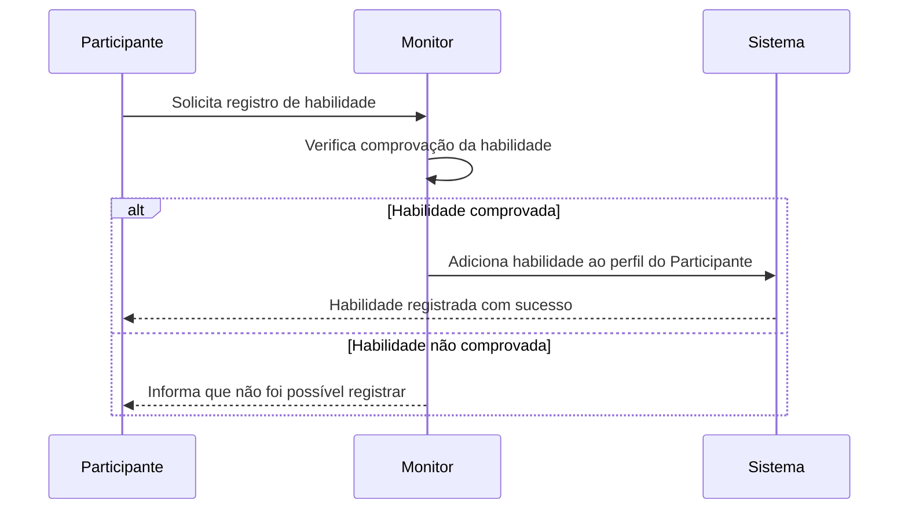

# Acesso a Equipamentos

Algumas Equipamentos do Espaço Maker possuem **restrições de uso**, seja por **idade mínima** ou pela necessidade de **comprovação de habilidade técnica**.  
Essas restrições garantem a **segurança** dos usuários e a **preservação dos equipamentos**.

---

## 📝 Regras de Uso
- O Participante deve atender aos requisitos definidos para cada Recursos de Trabalho (treinamento comprovado).  
- Caso não cumpra os requisitos, o Participante **deve solicitar apoio ao Monitor**, que pode realizar a atividade ou auxiliar no uso da Recursos de Trabalho.  
- A adição de **habilidades a um Participante** só pode ser feita por um **Monitor**, mediante comprovação da habilidade técnica do Participante.  

---

## 🔎 Fluxo de Acesso a Recursos de Trabalhos (Diagrama de Sequência)

## Fluxo de adição de habilidade 
