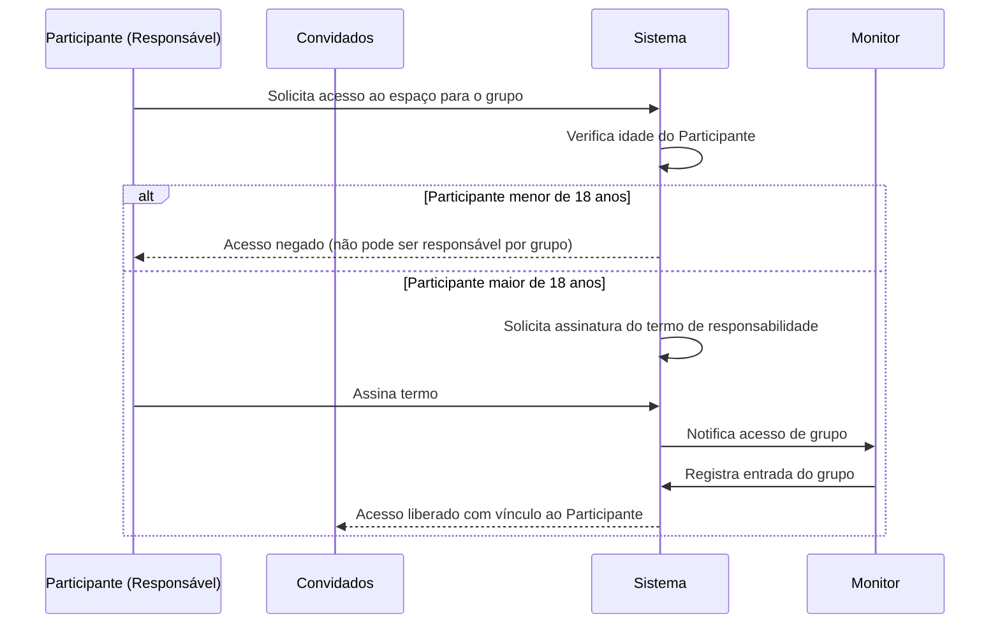

# Acesso de Grupos

O sistema permite que um **Participante** leve convidados para utilizar o Espaço Maker.  
Um exemplo comum é o de um **Professor Participante** que leva seus alunos para participar de uma **Atividade Programada**.  

---

## 📝 Regras de Acesso de Grupos
- A entrada é registrada em nome do **Participante responsável** pelo grupo.  
- O Participante responsável deve ser **maior de 18 anos**.  
- Para que o grupo tenha acesso ao espaço, o Participante responsável deve assinar um **termo de responsabilidade**.  
- Todos os convidados estão vinculados ao cadastro e à autorização do Participante responsável.  

---

## 🔎 Fluxo de Acesso de Grupos (Diagrama de Sequência)

