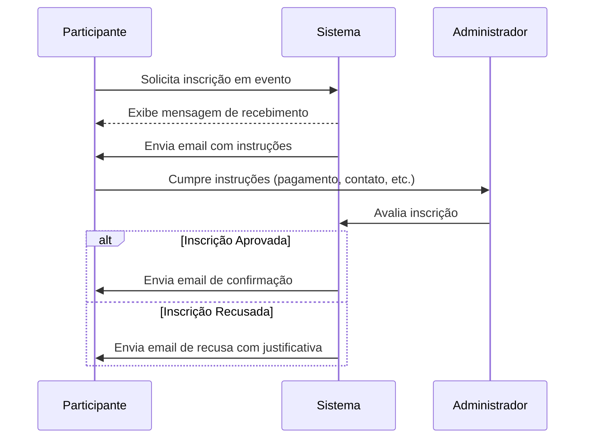
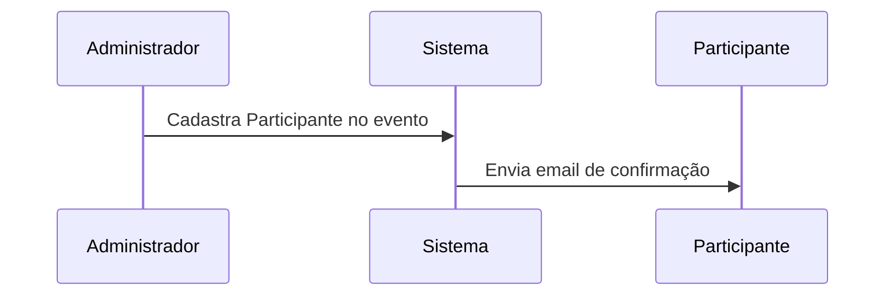

# Eventos

O módulo de **Eventos** no Espaço Maker tem como objetivo organizar e controlar atividades especiais como **cursos, palestras, exposições e mostras**.  
Ao realizar o **cadastro de um evento**, os horários correspondentes são **reservados automaticamente na agenda**, garantindo que não haja conflitos de uso do espaço.

---

## 📌 Tipos de Eventos

No sistema, existem **dois tipos principais de eventos**:

1. **Eventos com controle de inscritos**  
   - Exemplo: **Cursos e Palestras**.  
   - Requer que os participantes sejam previamente cadastrados, garantindo melhor organização e controle do público.  

2. **Eventos sem controle de inscritos**  
   - Exemplo: **Exposições e Mostras**.  
   - Nesses casos, não há necessidade de controle de acesso, pois o público é **rotativo** e a presença não é registrada individualmente.  

---

## 📝 Eventos com Controle de Inscritos

Para conseguir solicitar uma inscrição o Participante já deve estar registrado no sistema. 

Para os eventos que exigem **cadastro de participantes**, existem duas formas de inscrição:

---

### 🔓 Inscrições Abertas
- O próprio **Participante** pode solicitar a inscrição diretamente na página do evento.  
- Após a solicitação:
  - O Participante receberá um **email automático** confirmando o recebimento do pedido.  
  - O email trará instruções específicas, que podem incluir:
    - Aguardar contato do responsável;  
    - Efetuar pagamento na secretaria;  
    - Aguardar mensagem via WhatsApp;  
    - Outros passos definidos pelo organizador.  
- Após cumprir as instruções, o **Administrador** do sistema deve avaliar a inscrição:
  - **Se aprovado**, o Participante receberá um **email de confirmação**.  
  - **Se recusado**, o Participante receberá um **email de recusa**, informando que não poderá participar do evento e, quando aplicável, o motivo da recusa.  

#### 📊 Fluxo (Diagrama de Sequência)

---
### 🔒 Inscrições Fechadas

Somente o Administrador pode cadastrar Participantes diretamente no evento.
Essa modalidade é utilizada quando há critérios específicos de seleção ou necessidade de controle restrito.

Nesse caso, o Administrador realiza a inscrição e a aprovação é automática:

---
## ✅ Benefícios do Sistema de Eventos

Automatiza a reserva de horários na agenda do espaço.

Garante organização no fluxo de inscrições e comunicação clara com os participantes.

Permite lidar tanto com eventos de grande público rotativo quanto com atividades que exigem inscrição controlada.

Dá clareza e transparência ao processo, inclusive nos casos de recusa de inscrição.